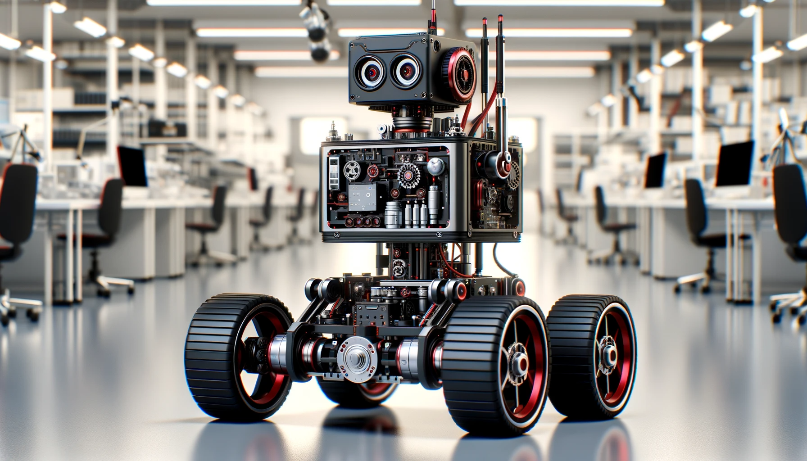

# Road Following Robot

## Introduction

Road following, a fundamental aspect of autonomous vehicle navigation, involves the implementation of control algorithms that enable a robot to detect and follow a predefined path. The task requires an understanding of basic robotic principles, sensor integration, and algorithmic control. CoppeliaSim, a versatile and powerful robotics simulation platform, will be utilized for this purpose. It allows for realistic modeling of robotic sensors and motion, offering an ideal environment for testing and refining road following algorithms. In conjunction with CoppeliaSim, Python programming is used to create and control robotic models.



_Figure 1: Four-Wheel Differential Drive Robot_

## CoppeliaSim

CoppeliaSim is a prominent player in the realm of robotics simulation. Engineered for versatility and power, this platform provides a simulated 3D environment where robotic models and algorithms can be rigorously tested and refined. The software's ability to accurately mimic real-world physics and various sensor modalities makes it a preferred choice for educational and research purposes in robotics.

Key Features Relevant to the Lab:

**Realistic Physics Simulation:** CoppeliaSim offers an advanced physics engine that closely replicates real-world dynamics. This feature is crucial for testing the physical interactions of robots with their environment.

**Wide Range of Sensors:** The platform supports a comprehensive array of simulated sensors, including vision sensors, proximity sensors, and inertial measurement units, essential for navigation tasks like road following.

**Scripting Flexibility:** CoppeliaSim allows for scripting in several languages, including Lua and Python, providing versatility in programming approaches for different levels of complexity.

**Customizable Environments:** Users can create and modify environments, offering the ability to tailor scenarios depending on requirements.

**Remote API Functionality:** This feature enables the control of simulation elements via external programs, such as Python scripts, allowing for more sophisticated control algorithms and real-time data processing.

This robust suite of features positions CoppeliaSim as an ideal tool for exploring and implementing robotic navigation and control systems, specifically in the context of this lab's focus on road following. manner

## Lab Environment Setup

### Setting Up CoppeliaSim

Ensure CoppeliaSim is installed on your system.
You can download the $edu$ version from the [official site](https://www.coppeliarobotics.com/downloads)

Verify that the installation is successful by launching CoppeliaSim and exploring its basic features.

**Scene Preparation:** A custom scene with multiple robots has been prepared for this lab. [Download the scene](files/MultiRobot.ttt).
 Upon starting CoppeliaSim, load the provided scene file. This file contains predefined paths and robot models set up for the road-following task.

Spend some time familiarizing yourself with the CoppeliaSim environment. Understand how to navigate the interface, manipulate objects, and observe robot behavior within the simulation.

### Python Setup for Robot Control

If not already installed, set up Python on your system. Python 3.x is recommended for compatibility. Ensure that your Python environment is working correctly by running a simple test script.

**Library Installation:** Install the CoppeliaSim Python API. This library is crucial for interfacing with CoppeliaSim from Python scripts.

```
pip install -r requirements.txt
```

**API Testing:** Test the Python-to-CoppeliaSim connection by running a basic script that interacts with the simulation, such as starting and stopping the simulation.
This setup provides the foundation for you to start developing and testing your road following algorithms in a controlled simulation environment. The next section will guide you through the development of the road following algorithm.

### Getting started with CopeliaSim and python programming

ZeroMQ Remote API interface provided by CoppeliaSim which allows a more Pythonic interaction with CoppeliaSim objects. Below are some of the key API handles to get started:

- **self.sim.getObject** : Retrieves an object handle based on its path and alias
  ```
      # Retrieve the handle of an object (e.g., a motor or sensor)
      object_handle = self.sim.getObject('/objectName')
  ```
- **self.sim.getVisionSensorImg** : Reads the image of a vision sensor.

  ```
      img = self.sim.getVisionSensorImg(self.vision_sensor)
  ```

- **sim.setJointTargetVelocity** : Sends motor speed commands to the robot.

  ```
      self.sim.setJointTargetVelocity(self.left_motor, left_speed)

  ```

## Documentation and Reporting

As you test and optimize, document your findings. Note down what worked, what didn’t, and how you adjusted your approach.
This documentation will be invaluable for your final report and provides a clear record of your problem-solving process.
Testing and optimization are as much a part of the learning process as the initial development. They provide insight into the practical challenges of robotics and the importance of iterative design.

### Documenting the Code

**Code Comments:** Include comprehensive comments throughout your Python script. Explain the purpose of functions, logic behind critical sections, and meanings of key variables. Use inline comments for complex lines of code to clarify their functionality.

**Readable Structure:** Organize your code logically. Group related functionalities into functions or classes and use clear, descriptive names for variables and functions.
Ensure your script follows a consistent coding style for ease of reading and maintenance.

### Writing the Lab Report

**Introduction:** Briefly introduce the objectives of the lab, the significance of road following in robotics, and an overview of your approach.

**Methodology:** Detail the algorithm you developed. Discuss your choice of sensors, control logic, and any specific programming techniques used. Include diagrams or flowcharts if they help clarify your algorithm’s structure.

**Discussion:** Analyze the results. Discuss any challenges faced, how you addressed them, and what you learned from the process. Reflect on the effectiveness of your algorithm and potential improvements.

**Conclusion:** Summarize your findings and the insights you gained regarding robotic road following.

**References:** Include any references to external resources, such as textbooks, papers, or online materials, that assisted you in the lab.

### Deliverables

1. Python script files as .py files
2. Lab report in PDF format

### Evaluation Criteria

1. Accuracy and Functionality: The robot's ability to follow the designated path accurately and consistently

2. Smoothness of navigation

3. Well-structured and logically organized code.

4. Comprehensive comments explaining the purpose and logic of the code.

5. Quality of report.

## References

1. https://manual.coppeliarobotics.com/
